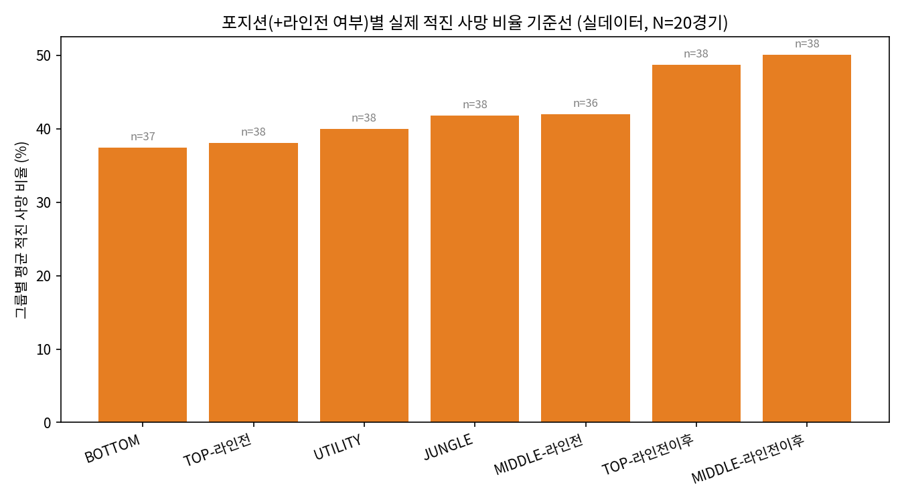

# 롤(LoL) 사망 위치 기반 이상 사망 패턴 분석
### — 포지션·라인전 단계별 기준선 검증 및 오탐(false positive) 감소 가능성 —

> **지원 목표**: 본 프로젝트는 크래프톤(Krafton)의 UGC·메타버스
> 자회사인 **오버데어(OVERDARE)** 데이터 분석가 채용 지원을 위한
> 포트폴리오 프로젝트임.
>
> **데이터 고지**: `01_가상데이터_버전`은 실제 데이터가 아니라
> 도메인 지식을 기반으로 생성한 가상(합성) 데이터이며, 방법론(그룹
> 정의·Z-score 로직) 자체의 타당성만을 사전 검증하는 용도로 사용함.
> `02_실데이터_버전`은 Riot Match-V5 API로 실제 수집한 매치
> 데이터(20경기, 1141건)이며, 본 보고서의 모든 결과·통계 수치는
> 이 실데이터를 기준으로 함.
>
> **AI 활용 고지**: 본 프로젝트의 코드 구현, 통계 계산, 문서 초안
> 작성 등에는 작업 도구로 Claude(Anthropic)를 활용함. 가설 설계,
> 프로젝트 방향 전환 판단, 결과 해석, 재검증 필요 여부에 대한 판단은
> 본인이 직접 수행함.

---

## 요약

- 포지션(및 탑/미드는 라인전 진행 단계)별로 '적진 사망' 비율의
  정상 기준이 다르다는 가설을 실제 Riot API 매치 데이터(20경기,
  1141건 사망 이벤트)로 검증함.
- 그룹별 평균 적진 사망 비율은 가설이 예측한 방향(ADC 최저, 라인전
  이후 TOP/MID 최고)과 경향상 일치하였으나, 통계적 유의성 검정 결과
  (p=0.552) 이 표본 크기로는 그룹 간 차이를 통계적으로 확정할 수
  없었음.
- 통계적 확정에는 이르지 못했으나, 포지션을 고려하지 않는 단순
  절대 기준과 비교했을 때, 포지션 기반 기준을 적용하면 정상 플레이를
  하는 유저가 트롤로 오인되어 플래그되는 사례를 뚜렷이 줄일 수
  있음을 확인함. 이는 오탐으로 인한 정상 유저의 불필요한 제재 위험을
  낮추는 방향으로 이어질 가능성을 시사함.
- 본 프로젝트는 이 지점에서 범위를 마무리하며, 표본 확대를 통한
  통계적 유의성 확보를 향후 과제로 남김.

---

## 1. 프로젝트 개요 및 목적 조정

본 프로젝트는 KDA와 같은 단일 지표만으로 트롤 플레이를 판단하는
방식의 한계를 보완하기 위해, 사망 시점의 게임 진행 시간과 사망
좌표를 함께 고려한 트롤탐지 강화를 초기 목표로 시작함.

분석을 진행하는 과정에서, 실제로 구현된 내용은 '적진 사망'이라는
단일 지표에 포지션 및 라인전 진행 단계라는 도메인 지식 기반 구분을
추가한 것에 해당하며, 트롤 여부를 직접 판별할 수 있는 근거는 제한적
이라는 점을 확인함. 이에 따라 프로젝트의 목적을 다음과 같이 재조정함.

- (변경 전) 좌표·시간 정보를 활용한 트롤탐지 정확도 향상
- (변경 후) 포지션·라인전 단계별 사망 위치 기준선에 대한 가설의
  통계적 검증, 그리고 그 과정에서 발견된 오탐 감소 가능성 제시

본 프로젝트는 개인이 단독으로 가설을 수립하고 검증한 작업이나, 실무
에서 데이터 분석 결과는 분석가 개인이 아니라 기획·개발·운영 등 타
직군과의 협업을 통해 의사결정에 반영되는 경우가 대부분임. 이를
염두에 두고, 통계적 배경지식이 없는 독자도 핵심 결론과 논리적
흐름을 따라올 수 있도록 통계 용어에는 쉬운 설명을 병기하고, 세부
방법론보다 요약과 결론을 먼저 배치하는 방식으로 문서를 작성함.

---

## 2. 배경 및 가설

'적진에서 죽었다'는 신호를 모든 포지션에 동일한 기준으로 적용할
경우 오탐이 발생할 수 있다는 도메인 지식에서 출발함.

| 포지션 | 가설 |
|---|---|
| 정글 / 서포터 | 시야 장악, 카운터정글, 침투 플레이 등으로 적진 사망이 상시 잦음 |
| 탑 / 미드 | 라인전(~15분) 중에는 적진 사망이 드물어야 하나, 이후 로밍·사이드 운영 증가로 자연스럽게 늘어남 |
| 원딜 | 팀 자원이 집중되고 라인 제약이 커 적진 사망 자체가 상대적으로 드묾 |

이 가설이 성립한다면, 전체 유저를 통합한 단일 기준이 아니라
포지션(및 탑/미드는 라인전 여부)별 그룹으로 나누어 비교해야 하며,
그룹 간 적진 사망 비율에 통계적으로 유의미한 차이가 존재해야 함.

---

## 3. 데이터 및 방법론

### 3.1 데이터셋
Riot Match-V5 API를 통해 수집한 실제 매치 20건, 사망 이벤트 1141건.
필드: `match_id, player_id, position, game_time, death_x, death_y`.

### 3.2 실데이터 적용 시 처리한 이슈

가상 데이터로 방법론을 사전 검증한 이후 실데이터에 적용하는 과정에서
다음과 같은 문제들을 확인하였고, 각각 아래와 같이 처리함.

| 이슈 | 처리 방법 |
|---|---|
| 좌표만 존재하고 '적진 사망 여부'가 사전 계산되어 있지 않음 | Riot 매치 타임라인 공개 맵 데이터(hextechdocs.dev)의 블루/레드 넥서스 타워 좌표 평균을 각 팀 베이스 좌표로 근사(블루 ≈1962,2038 / 레드 ≈12831,12848)하고, 각 사망 지점이 자기 베이스보다 적 베이스에 더 가까운 경우를 적진 사망으로 정의 |
| 팀 구분 컬럼 부재 | `player_id 1~5=블루팀, 6~10=레드팀`이라는 Riot 관례를 가정 후, 1~5의 평균 사망좌표 합이 6~10보다 유의하게 낮다는 것을 실측으로 확인하여 관례와의 일치 여부를 검증 |
| `player_id`가 매치마다 초기화되는 참가자 슬롯 번호 | 집계 기준을 `(player_id, group)`에서 `(match_id, player_id, group)`으로 수정. 분석 단위가 '여러 경기에 걸친 동일 인물'이 아니라 '한 경기 내 한 참가자'임을 명시 |
| 조기 종료(리메이크) 매치 혼입 | 매치당 사망 이벤트 수가 10건 미만인 매치를 분석에서 제외 |
| 소표본(데스 1~2건) 노이즈 | 데스 4건 이상인 표본만 통계적으로 신뢰 가능한 것으로 별도 표시 |

### 3.3 통계적 검증 방법
그룹 간 평균 비교만으로는 검증으로 보기 어렵다고 판단하여, 다음
방법으로 통계적 유의성을 검정함.

- **비모수 검정 사용**: 그룹당 표본이 36~38개로 작고, 값이 0~1
  사이의 비율 형태라 정규분포(데이터가 평균을 중심으로 좌우 대칭인
  종 모양 분포를 따른다는 가정)를 전제하기 어려워, 이런 가정이
  필요 없는 비모수 검정을 사용함.
- **Kruskal-Wallis 검정**: 3개 이상의 그룹 값을 한 번에 비교해,
  그룹 간 차이가 우연히 발생했을 가능성이 낮은지를 판단하는 방법.
  전체 그룹 비교에 사용함.
- **Mann-Whitney U 검정**: 두 그룹의 값을 비교해, 한쪽이 다른 쪽보다
  통계적으로 더 크다고(또는 작다고) 볼 수 있는지 판단하는 방법.
  가설이 예측한 개별 방향 비교(예: ADC가 미드보다 낮은지)에 사용함.
- **p-value(유의확률)**: 지금 관찰된 차이가 실제로는 차이가 없는데도
  우연히 나타났을 확률. 통상 0.05보다 작으면 "우연이 아니다(통계적
  으로 유의하다)"라고 판단함.

---

## 4. 결과

### 4.1 그룹별 기준선

아래 표준편차는 그룹 내 값들이 평균에서 얼마나 흩어져 있는지를
나타내는 지표로, 값이 클수록 그룹 내 개인차가 크다는 의미임.

| 그룹 | 표본수 | 평균 적진사망비율 | 표준편차 |
|---|---|---|---|
| BOTTOM | 37 | 0.374 | 0.284 |
| TOP-라인전 | 38 | 0.381 | 0.312 |
| UTILITY | 38 | 0.400 | 0.277 |
| JUNGLE | 38 | 0.418 | 0.301 |
| MIDDLE-라인전 | 36 | 0.420 | 0.405 |
| TOP-라인전이후 | 38 | 0.487 | 0.348 |
| MIDDLE-라인전이후 | 38 | 0.501 | 0.344 |

### 4.2 통계적 유의성 검정

- 전체 그룹 간 차이(Kruskal-Wallis 검정): H=4.938, **p=0.552 →
  유의하지 않음(우연히 나타난 차이일 가능성을 배제할 수 없음)**
- 개별 방향 검정(Mann-Whitney U 검정, 한쪽 방향으로만 큰지 검정):

| 가설 방향 | p-value | 판정 |
|---|---|---|
| BOTTOM < TOP-라인전이후 | 0.068 | 유의하지 않음 |
| BOTTOM < MIDDLE-라인전이후 | 0.048 | 유의함(다중비교 보정 전) |
| TOP 라인전 < 라인전이후 | 0.100 | 유의하지 않음 |
| MIDDLE 라인전 < 라인전이후 | 0.174 | 유의하지 않음 |

4개의 개별 검정 중 다중비교 보정(같은 데이터로 여러 번 검정을
반복하면 그중 하나는 우연히 유의한 결과가 나올 확률이 높아지므로,
이를 막기 위해 판정 기준을 더 엄격하게 조정하는 절차. 대표적으로
Bonferroni 보정이 있음) 없이 유의했던 것은 1건뿐이며, 보정을
적용하면 이마저도 유의성이 사라짐. 따라서 그룹별 기준선의 방향성은
가설과 경향상 일치하나, 20경기 규모의 표본으로는 통계적으로
확정할 수 없으며, 이는 검정력(실제로 차이가 존재할 때 그 차이를
통계적으로 감지해낼 수 있는 능력. 표본이 작을수록 낮아짐) 부족에
해당함.

### 4.3 사례 검토

Z-score(개별 값이 그룹 평균에서 표준편차 몇 배만큼 떨어져 있는지를
나타내는 지표로, 값이 클수록 그 그룹 안에서 이례적인 값임을 의미함)와
최소 표본(데스 4건 이상) 기준을 함께 적용해 도출된 고신뢰 의심
케이스 1건(특정 매치의 BOTTOM 포지션 참가자, 4데스 전부 적진, 게임
5분 이내 적 바텀 진영에서 반복 사망)을 실제 전적 조회 및 리플레이
기록으로 검증함. 검증 결과 트롤 플레이가 아닌 특수한 상황으로
확인됨(개인정보 보호를 위해 구체적 내용은 비공개).

이 사례는 그룹 간 차이가 통계적으로 확정되지 않은 상태에서 개별
사례 하나만으로 결론을 내리는 것이 갖는 위험성을 보여줌.

---

## 5. 실무적 함의: 오탐 감소 가능성

포지션을 고려하지 않는 단순 절대 기준(예: 적진 사망 비율 70%
이상이면 의심)을 적용했을 때와, 포지션별 기준선 기반 Z-score를
적용했을 때를 비교함(신뢰 가능 표본 149건 기준).

| 방식 | 플래그 건수 | 비고 |
|---|---|---|
| 절대 기준(포지션 무시, 70% 이상) | 29건 | 이 중 28건(96.6%)이 해당 포지션 기준으로는 정상 범위(z≤2) |
| 포지션 기반 Z-score | 1건 | 실제 검증 결과 트롤 아님(4.3절 참고) |

절대 기준을 적용할 경우 플래그되는 인원 대부분이 정글·서포터·바텀·
라인전 이후 탑/미드처럼 원래 적진 사망 빈도가 높은 포지션에 집중되어
있었음. 이는 포지션을 고려하지 않는 단순 기준을 사용할 경우, 정상적인
플레이를 하는 유저가 트롤로 오인되어 불필요하게 제재 대상에 오를
위험이 있으며, 포지션 기반 기준을 적용하면 이러한 오탐 위험을 줄일
수 있음을 시사함.

단, 위 70% 기준은 실제 운영 중인 시스템의 기준이 아니라 비교를 위해
설정한 예시 값이며, 본 프로젝트에서 오탐 감소가 실제 유저 이탈
감소로 이어지는지를 직접 측정하지는 않음. 다만 오탐으로 인한 제재는
일반적으로 유저 이탈과 연관되는 문제로 알려져 있어, 본 결과가 그
방향으로 이어질 실무적 함의를 갖는다고 볼 수 있음.

---

## 6. 한계

- **검정력 부족**: 20경기·그룹당 36~38개 표본으로는 그룹 간 차이의
  통계적 유의성을 확정하기 어려움. 표본 확대 시 유의성이 확보되는지
  확인하는 것이 가장 중요한 후속 과제임.
- **좌표 기반 판정의 지역적 부정확성**: 사례 검토 과정에서, 실제로는
  자기 팀 라인 코너 근처였음에도 넥서스 직선거리 계산상 근소한
  차이로 적진 사망으로 판정된 경우를 확인함. 맵 중앙(미드/강가)
  에서는 이 방식이 잘 들어맞으나, 라인 외곽 지역에서는 다소
  부정확해질 수 있음.
- **정답 라벨 부재**: 실데이터에는 트롤 여부에 대한 정답 라벨이
  없어 정밀도/재현율과 같은 정량적 성능 지표를 산출할 수 없었으며,
  개별 사례에 대한 정성적 검증으로 대체함.
- **인과관계 미측정**: 5절의 오탐 감소와 유저 이탈 방지 간의 연결은
  실무적 함의로 제시한 것이며, 본 프로젝트에서 그 인과관계를 직접
  측정하지는 않음.

---

## 7. 결론

본 프로젝트는 포지션·라인전 단계에 따라 적진 사망 비율의 정상
기준이 다르다는 가설을, 실제 API 데이터의 좌표 정보를 이용해
검증하고자 함. 그룹별 기준선은 가설과 방향상 일치하였으나 통계적
으로는 확정되지 않음(Kruskal-Wallis 검정 p=0.552, 기준값 0.05보다
훨씬 커 우연에 의한 차이일 가능성을 배제할 수 없는 수준). 그럼에도
불구하고, 포지션을 고려하지 않는 단순 기준과의 비교를 통해, 포지션
기반 접근이 정상 플레이어를 트롤로 오인하는 위험을 줄일 수 있다는
근거를 확인함. 표본 확대를 통한 통계적 검증 강화를 향후 과제로
남기고, 본 프로젝트는 이 범위에서 마무리함.

---

## 8. 파일 구성

| 파일 | 역할 |
|---|---|
| `setup_lol_db.py` / `lol_death_events_real.csv` | 데이터 적재 (가상/실데이터) |
| `lol_troll_detection.sql` | 그룹 정의·Z-score 로직 — 가상 데이터 버전 |
| `lol_troll_detection_real.sql` | 그룹 정의·Z-score 로직 — 실데이터 버전 (팀판별, 좌표 기반 적진 판정, 소표본 필터) |
| `run_lol_sql.py` / `run_lol_sql_real.py` | SQL 실행 러너 |
| `lol_hypothesis_test.py` | 그룹 간 차이 통계 검정 (Kruskal-Wallis, Mann-Whitney) |
| `lol_death_location_by_group.py` | 그룹별 기준선 시각화 |
